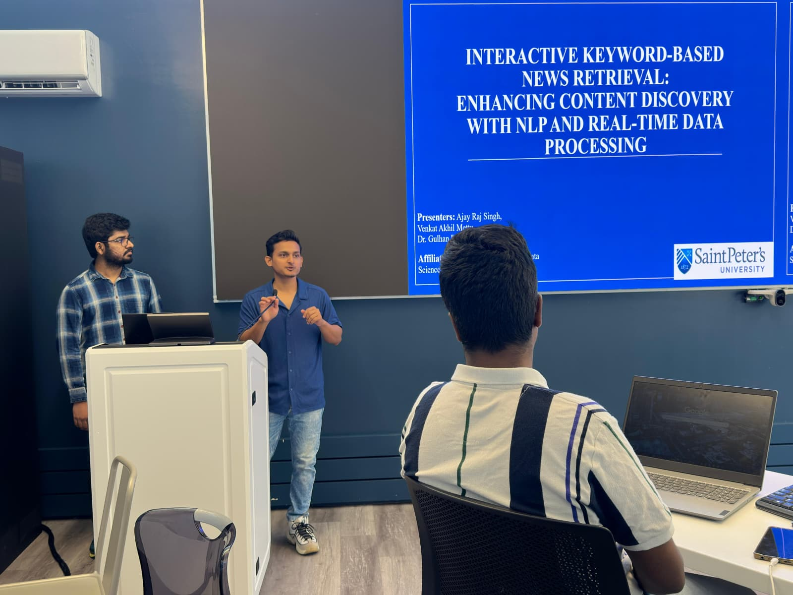

# Live News Platform - Trending Topics Explorer

## Interactive Keyword-Based News Retrieval: Enhancing Content Discovery with NLP and Real-Time Data Processing
**Saint Peter's Research** →[Saint Peter's Instant Newsroom for Student](https://word-cloud-peacock-eea067d6545e.herokuapp.com/)

A dynamic word cloud visualization platform that transforms trending news topics into interactive visual experiences. Built with advanced NLP techniques and real-time data processing, this system provides users with an intuitive way to explore evolving news landscapes.

## Overview

This research project, developed in association with Saint Peter's University, addresses the growing need for accessible news exploration tools. By combining Google Trends data with news headlines, our system enhances the contextual relevance of trending keywords and provides real-time insights into current events.

Unlike static word clouds, our system dynamically processes real-time news data using Natural Language Processing (NLP), web scraping, and API integration. It extracts and visualizes frequently occurring keywords, allowing users to interact with them. Upon selection, the system triggers a query-based retrieval mechanism to fetch relevant multimedia content, including articles and videos, in real time. This interactive approach bridges the gap between static visualization and dynamic content retrieval, enabling users to explore evolving news trends efficiently.

## Architecture


### Frontend
- Web Server: Node.js/Express serving static HTML
- Visualization Engine: D3.js for interactive word clouds
- Client-side Logic: Vanilla JavaScript for user interactions
- Data Format: JSON files generated by the Python pipeline

### Backend Pipeline
- Data Sources: NYTimes Top Stories API, Microsoft Bing News and Video Search APIs
- NLP Processing: NLTK for text analysis
- Trend Scoring: Hybrid algorithm combining word frequency (40%) with PyTrends data (60%)
- Visualization Generation: WordCloud library for visual processing

## Quick Start

### Demo Mode
For exploring the interface with sample data:

```bash
git clone https://github.com/ajayrajsingh2003/live-news-platform.git
cd live-news-platform
npm install
npm start
```

Open `http://localhost:3000` to explore the platform with pre-loaded sample data.

### Full Pipeline Setup

Install Python dependencies:
```bash
pip install requests nltk wordcloud matplotlib pytrends python-dotenv
```

Configure API keys by creating `config/.env`:
```env
NYT_API_KEY=your_nytimes_api_key_here
AZURE_API_KEY=your_bing_search_api_key_here
```

Required API keys:
- NYTimes API: Register at developer.nytimes.com
- Microsoft Bing Search API: Available through Azure Cognitive Services

Generate fresh data:
```bash
python src/main.py
```

Launch the platform:
```bash
npm start
```

## Data Processing Pipeline

The system employs a multi-stage data processing workflow:

**Stage 1: Data Acquisition**
- Headlines Collection: Fetches top US news from NYTimes API
- Content Enrichment: Retrieves related articles and videos from Bing

**Stage 2: NLP Processing**
- Text Analysis: Keyword extraction and cleaning
- Trend Scoring: Advanced scoring algorithm combining word frequency analysis (40% weight) with Google Trends real-time data (60% weight)
- Visualization Preparation: Word cloud generation and JSON formatting

**Stage 3: Content Integration**
- Data Orchestration: Combines all data sources
- Output Generation: Creates optimized JSON files for frontend consumption

Generated data files include `wordcloud.json` for word frequencies and trending scores, and `headlines.json` for structured news articles and video content.

## Project Structure

```
live-news-platform/
├── src_code/                          # Python data pipeline
│   ├── main.py                   # Main orchestrator
│   ├── newYorkAPI.py            # NYTimes API client
│   ├── processHeadlines.py      # Text processing utilities
│   ├── processWords.py          # Trend analysis & scoring
│   └── videoDataAzure.py        # Bing API integration
├── public/                       # Frontend assets
│   ├── wcindex.html             # Main web application
│   ├── wordcloud.json           # Word frequency data
│   └── headlines.json           # News content database
├── presentations/                # Presentation docs
│   ├── project_poster.pdf       # poster presented at symposiums
│   ├── project_slides.pptx      # project slides
├── assets/                       # Visual resources
├── data/                         # Sample datasets
├── config/                       # Configuration files
├── server.js                     # Express server
├── package.json                  # Node.js dependencies
└── README.md                     # Documentation
```

## Usage

The interface provides several interaction methods:

1. Word Cloud View: Interactive visualization loads automatically
2. Topic Selection: Click any word to discover related content
3. Content Browser: Switch between news articles and video tabs
4. Pagination: Load more results for comprehensive coverage
5. Layout Toggle: Switch between cloud and structured grid views
6. Theme Control: Toggle between dark and light modes

Advanced features include color-coded categories for visual distinction, responsive design optimized for all devices, lazy loading for efficient performance, and real-time updates through pipeline execution.

## Deployment

The platform is ready for Heroku deployment:
```bash
git push heroku main
```

The architecture supports flexible deployment with frontend independence, modular pipeline design, and scalable integration options for additional news sources.

## Technology Stack

**Frontend Technologies:**
- Node.js with Express framework
- D3.js for interactive graphics
- Modern HTML5, CSS3, and vanilla JavaScript
- Mobile-first responsive design

**Backend & Data Processing:**
- Python 3.8+
- NLTK for natural language processing
- WordCloud and Matplotlib for visualization
- PyTrends for Google Trends integration
- NYTimes Top Stories and Microsoft Bing Search APIs

## Applications

**Educational Use Cases:**
- News literacy through interactive media exploration
- Data journalism and trend analysis for story development
- Research projects studying information flow patterns
- Media studies examining news topic evolution

**Technical Contributions:**
- Novel hybrid scoring algorithm combining frequency and trend data
- Real-time NLP pipeline for streaming news processing
- Advanced D3.js implementation for news exploration
- Modular architecture supporting reusable components

## Recognition & Impact

This project has been showcased at **Symposium 2025 (SPU)**, the **NJBDA Symposium & Research Conference 2025**, and as part of a **Guest Lecture at Saint Peter’s International Exchange Program (India) 2025**.  
These presentations highlight our project's academic validation, community impact, and global reach.

### 📸 Gallery (Click to View LinkedIn Posts)

| Symposium @ SPU 2025 | NJBDA Symposium |
|----------------------|-----------------|
| [](https://www.linkedin.com/feed/update/urn:li:activity:7323804099462762496/?updateEntityUrn=urn%3Ali%3Afs_feedUpdate%3A%28V2%2Curn%3Ali%3Aactivity%3A7323804099462762496%29) | [](https://www.linkedin.com/feed/update/urn:li:activity:7330083180433002496/?updateEntityUrn=urn%3Ali%3Afs_feedUpdate%3A%28V2%2Curn%3Ali%3Aactivity%3A7330083180433002496%29) |

| NJBDA Research Conference                                                                                                                                                                                                                             | Guest Lecture (Exchange Program, India)                                                                              |
|-------------------------------------------------------------------------------------------------------------------------------------------------------------------------------------------------------------------------------------------------------|----------------------------------------------------------------------------------------------------------------------|
| [](https://www.linkedin.com/feed/update/urn:li:activity:7330083180433002496/?updateEntityUrn=urn%3Ali%3Afs_feedUpdate%3A%28V2%2Curn%3Ali%3Aactivity%3A7330083180433002496%29) | 

## Development Team

**Research & Development:**
- [**Ajay Raj Singh**](https://www.linkedin.com/in/connectwithajayrajsingh/)
- [**Venkata Akhil Mettu**](https://www.linkedin.com/in/venkata-akhil-mettu-51a48b277/)
- [**Gulhan Bizel**](https://www.linkedin.com/in/gulhan-vanli-bizel-phd-042b2728/)

**Academic Affiliation:**
- Saint Peter's University, Data Science Institute, Jersey City, NJ, USA

## License

This project is licensed under the MIT License. See the LICENSE file for complete details.

We welcome contributions including bug reports, feature suggestions, pull requests, and documentation improvements.

Built for accessible news exploration and data-driven journalism.